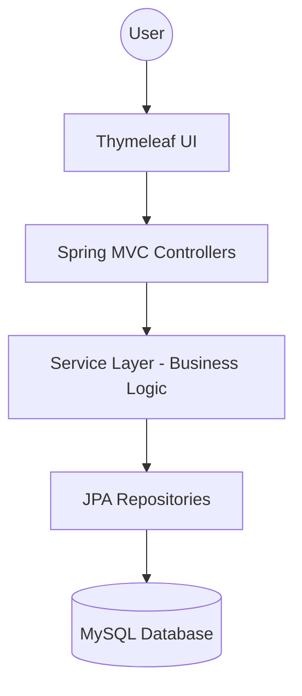
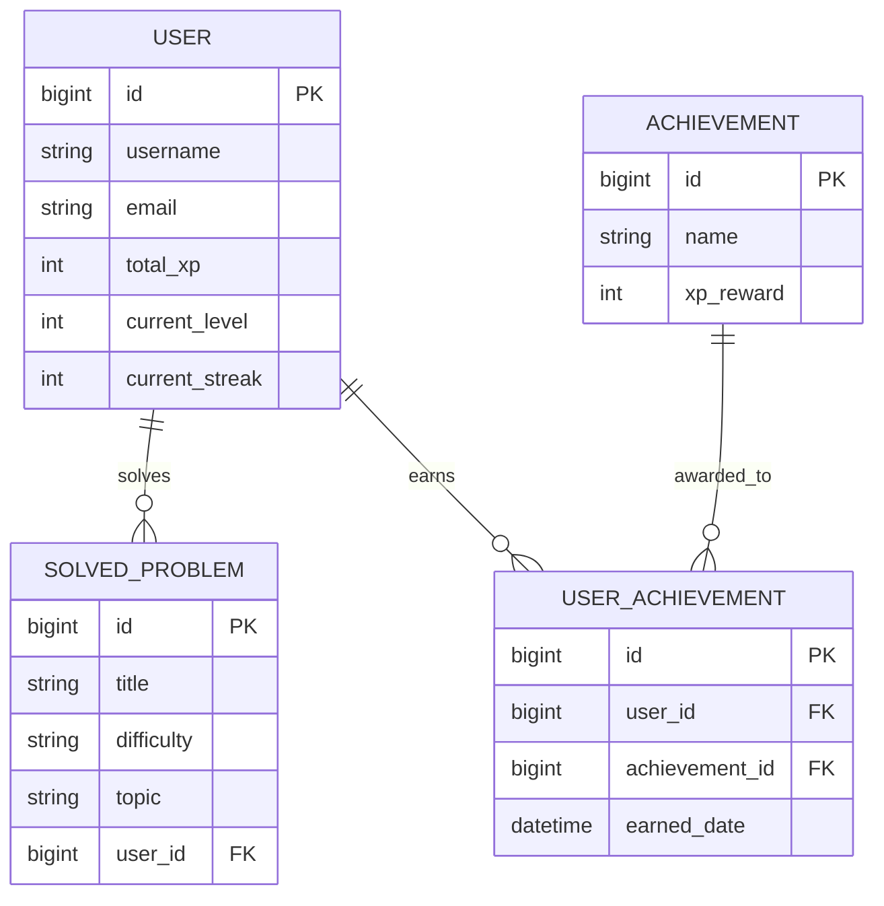

# DSA Quest - Gamified DSA Tracker Platform

DSA Quest is a full-stack web application designed to help developers track their Data Structures and Algorithms (DSA) progress through gamification, achievements, streaks, and progress tracking. Inspired by the gamification mechanics of platforms like LeetCode and Duolingo, it features XP rewards, level progression, streaks, achievements, and a global leaderboard to keep users motivated and consistent.

---

## 🚀 Features

- **Personalized Dashboard**: Real-time statistics including problem counts, XP, and streak tracking.
- **Problem Tracking**: Log solved problems with metadata (Difficulty, Topic, Platform, Link).
- **Gamification Engine**:
  - **XP System**: Earn points based on problem difficulty (Easy: 10, Medium: 25, Hard: 50).
  - **Level System**: Advance through levels as you accumulate XP.
  - **Achievement System**: Unlock badges for milestones like "First Problem," "7-Day Streak," etc.
- **Consistency Tracking**: Daily streak counter with longest streak history.
- **Global Leaderboard**: Compete with other users based on total XP and problem count.
- **Responsive UI**: Clean, modern interface built with Bootstrap 5.
- **Secure Authentication**:
  - BCrypt password hashing
  - Session-based authentication
  - Form validation and duplicate account prevention

---

## 🛠️ Technology Stack

- **Backend**: Java 21, Spring Boot 3.x, Spring MVC
- **Data Layer**: Spring Data JPA, Hibernate, MySQL 8.x
- **Frontend**: Thymeleaf, Bootstrap 5, Custom CSS
- **Tools**: Maven, IntelliJ IDEA, Git, GitHub

---

## 🏗️ Project Architecture

The application follows a standard **Layered Architecture**:

1. **Controller Layer**: Handles HTTP requests and interacts with services.
2. **Service Layer**: Contains core business logic (XP calculation, streak detection, etc.).
3. **Repository Layer**: Interface between the application and the MySQL database.
4. **Entity Layer**: Defines the data models and database relationships.

### Architecture Diagram


---

## 📂 Folder Structure

```text
dsa-quest/
├── src/main/java/com/dsaquest/
│   ├── config/             # App configurations
│   ├── controller/         # MVC Controllers
│   ├── entity/             # JPA Entities (User, Problem, Achievement)
│   ├── repository/         # Data Access Layer
│   ├── service/            # Business Logic Interfaces
│   │   └── impl/           # Logic Implementation
│   └── DsaQuestApplication # Main Application Class
├── src/main/resources/
│   ├── static/             # CSS, JS, Images
│   ├── templates/          # Thymeleaf HTML Views
│   └── application.properties # Configurations
├── schema.sql              # Database Schema & Sample Data
└── pom.xml                 # Maven Dependencies
```

---

## 📊 Database Design (ER Diagram)

The system utilizes four main tables with the following relationships:



---

## ⚙️ Setup Instructions

### 1. Prerequisites
- **Java 21** installed.
- **MySQL Server** installed and running.
- **Maven** installed.

### 2. MySQL Configuration
1. Open your MySQL terminal or Workbench.
2. Run the following command to create the database:
   ```sql
   CREATE DATABASE dsa_quest;
   ```
3. (Optional) Run the script provided in `schema.sql` to pre-populate achievements and a sample user.

### 3. Application Properties
Update `src/main/resources/application.properties` with your MySQL credentials:
```properties
spring.datasource.username=YOUR_USERNAME
spring.datasource.password=YOUR_PASSWORD
```

### 4. Running the Application
1. Clone the repository.
2. Navigate to the project root and run:
   ```bash
   mvn spring-boot:run
   ```
3. Open your browser and visit: `http://localhost:8080`

---

## 🔧 IntelliJ IDEA Execution

1. Open IntelliJ IDEA.
2. Go to **File > Open** and select the project folder.
3. Wait for Maven to index and download dependencies.
4. Right-click `DsaQuestApplication.java` and select **Run**.
5. The application will start on port 8080.

---

## 📌 Current Status

### Version 1.0 Completed

Implemented Features:
- User Authentication (BCrypt)
- Problem Tracking
- XP & Level System
- Achievement System
- Daily Streak Tracking
- Leaderboard
- Dashboard Analytics
- MySQL Persistence

Currently Developing:
- Multi-Platform Tracking
- Topic-wise Progress Analytics
- Blind 75 Tracker
- Striver A2Z Tracker

---

## 🔮 Future Enhancements
🚀 DSA Quest 2.0 Roadmap

- Multi-Platform DSA Tracking
- Topic-wise Progress Analytics
- Weak Topic Detection
- Blind 75 Tracker
- Striver A2Z Tracker
- Revision Scheduler
- AI Learning Coach

---

## 👨‍💻 Author

Megha Chauhan

GitHub: [MeghaChauhan278](https://github.com/MeghaChauhan278)
